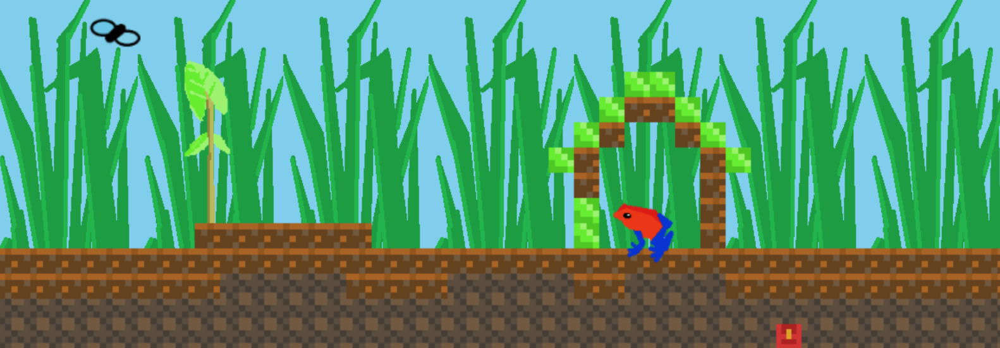
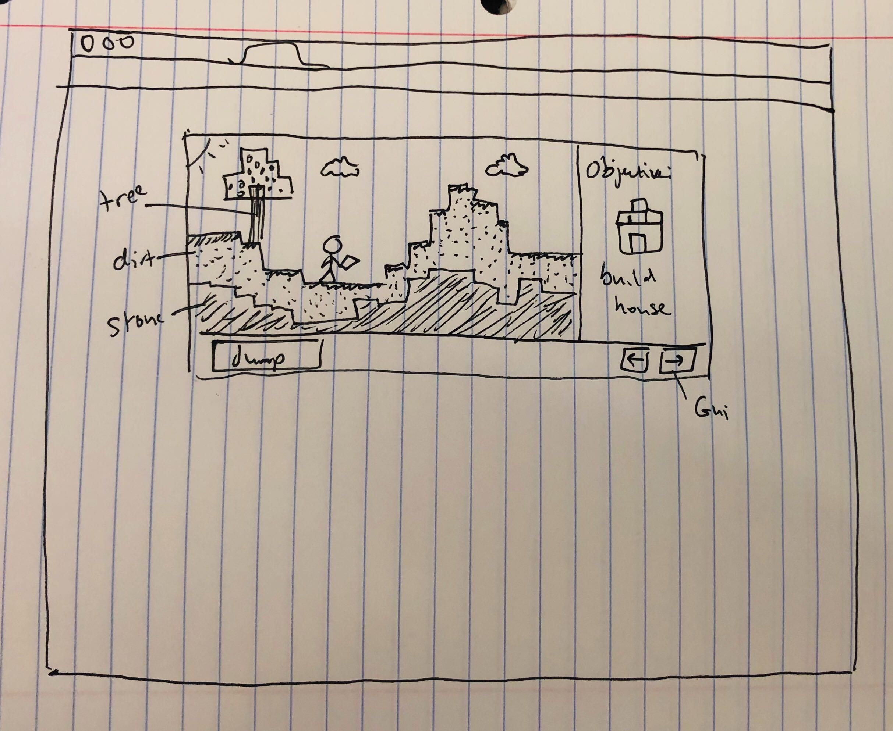
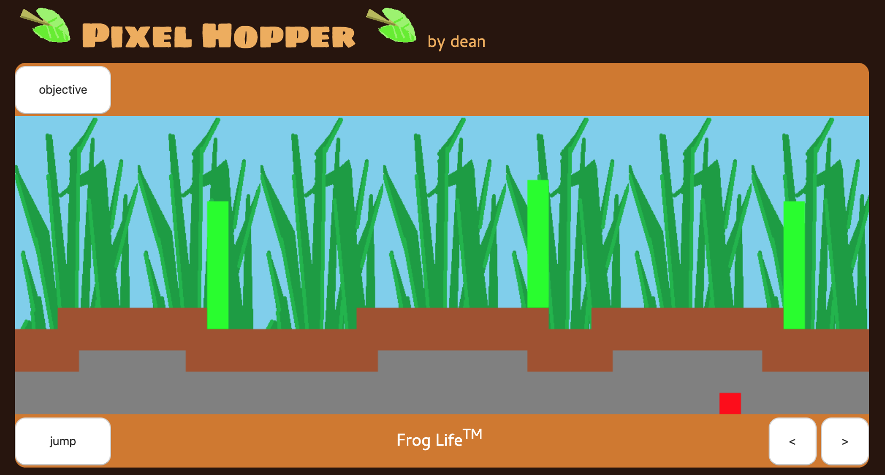
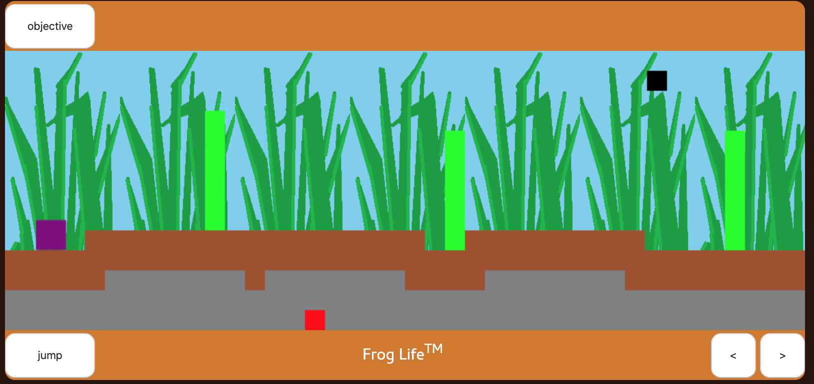
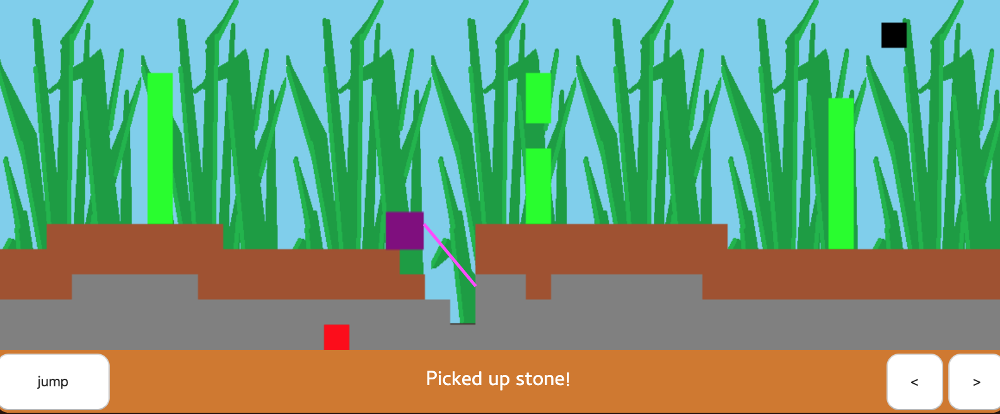
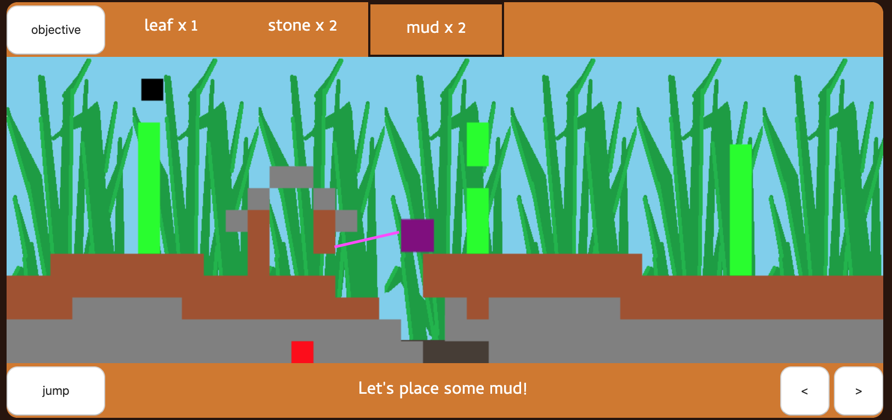
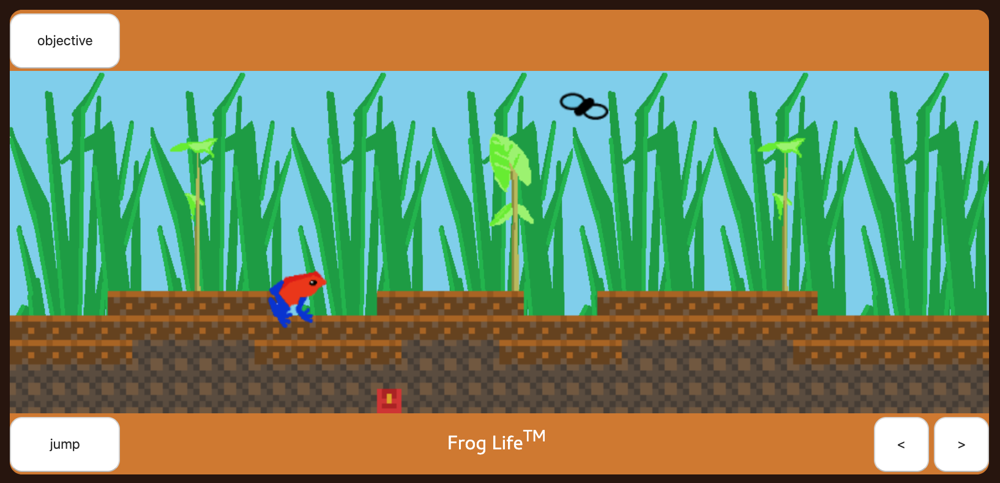

# Project 1: Frog Craft
### by erik-hei

## Game Link
https://erik-hei.github.io/frogcraft/

## 1. Project Planning

*Initial wireframe*

I want to build a pared down version of minecraft that would be two dimensional and have limited function, but essentially be a platformer with scenery manipulation. I wanted use basic HTML, CSS, and JS to create a viewer window where the game takes place, draw the scenery in CSS canvas, and then track game states and player movement using javascript funcionality. To make it unique, I came up with the concept of the player character being a frog, then the function of picking and placing blocks could be made visible to the user as the frog tongue. Once the terrain was spawning, and the frog could pick up blocks, I had to implement a inventory system and GUI for the user to place blocks. I added a win state so that the game has a general goal other than being a creative tool.

## 2. MVP
MVP was for the game to:

- Spawn random scenery upon loading
- Have a 2d physics engine for the player traverse the terrain
- Allow the player to pick up and place scenery
- Include a win state where the player finds treasure
- Implement a GUI for movement to make the game mobile friendly
- Have an objectives menu/message bar to provide user feedback

## 3. Gameplay / Obstacles
The gameplay developed over the course of the four days I spent working on the project.

### Day 1: Terrain

I started with building the terrain. It needed to spawn with some amount of randomness each time. As the terrain spawns, a string (e.g. "stone") is stored in a two dimensional array that accounts for every block space on the game board. There is also a gameloop function that is set via interval which renders the terrain each loop by iterating through the 2d array and drawing the type of block stored at each index. The game builds from the ground up: first the treasure chest is placed in a random location. Next, stone is drawn on the layer around it and above it. 3 hills are randomly spawned with random widths on top of that. 2 layers of mud are spawned on top of each stone block. One issue was getting the "corners" of the hills to spawn in mud, but after some tricky array manipulation, I was able to create the conditions for them to spawn. Next, leaves that were 6 blocks tall were spawned in 3 random places on top of the mud. 

### Day 2: Physics

The next day, I focused on spawning the player character and implementing a physics engine. I started with using a constructor function that works for both the fly and the frog. They both spawn at a random x location on the game board. The physics was tricky; I had never used gravity or collision in HTML canvas before, so I used a tutorial (link below). It took some foresight to figure out how to take the tutorial's code and transfer it to my game, since they had a few things about their gamespace that worked differently. My canvas has a gameLoop() function that works via interval, and they used another method. I also wanted my frog to hop as it moves left and right, so I had to add a component that changes the frog's y and y velocity when the left or right keys are pressed. Collision was tricky to implement, but when I finally had my sections of code arranged in roughly the same way as the tutorial, it was able to work. A 1d array stores a list of blocks with which the frog could possibly collide. I had to adjust the gravity and friction values so that the frog moved at the speed I wanted. 

### Day 3: Tongue

The tongue feature was tricky to implement. I wrote an event listener so that when the user clicks the canvas, a line is drawn between the frog and either the first block along the line OR the cursor if no blocks are hit. I added a direction for the frog so that the tongue appears in the frog's mouth and not behind it (e.g. when the frog is facing left, the tongue starts at the left side and vice versa). When the tongue hits a block, that block disappears both from the gamespace and the list of collision objects (this is accomplished by updating the 2d array, setting the list to zero, and then repopulating it based on the 2d array). What was difficult was writing the algorhythm to determine the first block hit by the tongue. What I developed was an iterator that checks every x pixel along the line, checks the y value at that pixel according to the slope and direction (positive/negative x and y) of the line, and looks at the cooresponding spot in the 2d array to see if it contains a block. 

### Day 4: Inventory and Graphics

*Inventory.* Now that the player could pick up blocks, I needed a place to store them. I built an inventory object which stores blocks by placing a key value pair of the block type and the amount (e.g. {stone: 1, leaf: 4}). I had to create a GUI to display the inventory to the user by manipulating the DOM and adding a div in the menu bar above the canvas. I then worked on a feature to select menu items when clicking them, which changes the appearance of the div by adding a border around it. Then, I added a placeBlock() function to take selected items, subtract it from inventory, and add it where the user clicks. Then the 2d array is updated, along with the list of collision objects. If an item in the inventory runs out, it is removed from the GUI. One problem was figuring out how to deselect an item in the inventory GUI so that the player could pick up blocks again without emptying their inventory. This was achieved by adding another event listener when the player clicks on an item that is already selected, and removing the event listener that places blocks when the user clicks. 

*Graphics.* Before I started the project, I spent the weekend drawing some sprites and terrain pictures in paint/Gimp. So far, the game had only used the background grass image, and a few images around the title as simple static aesthetic features. I looked into drawing images on Canvas, which was somewhat more complicated than drawing squares. I changed render functions in the the constructor function for the fly an frog to draw their images instead of squares, and added an extra "if" statement to make sure the image changed depending on which way the frog was facing. The renderTerrain() function was changed to draw images from a background sprite. Similar to minecraft, the textures for each block are all stored in one .png image, and are accessed by coordinates on the image, much like a sprite. Finally, I added an instruction section below the game to give the player some guidance.

*Sprite used for background textures*

## 4. Features

- The player can move (using the WASD keys) a 2d frog character that collides with scenery in a physics engine.
- The player can pick up blocks using the frog's tongue. The tongue picks up the nearest block to the frog along the line of the cursor.
- Once the player has an item in their inventory, it appears at the top of the screen. They can click on it to select it.
- The player can place the blocks using their tongue. Once blocks are place, they reintegrate into the game world and collision physics.
- The player can click on an item again to deselect it.
- A fly flies across the top of the screen. The player can click on it to eat it. 
- Once the player finds the treasure block, a message appears saying they have won the game. The message also tells them they can keep playing or restart, and if they restart, a new randomized gameworld will load without refreshing the page.
- The game is mobile friendly. The buttons at the bottom of the canvas allow the user to move as though they were pressing the WASD keys.
- All assets are custom (draw by me in MS Paint and Gimp ;) )

## 5. Stretch Goals

Some features I would like to include in the future: 

- Add a tutorial sequence.
- Add sound effects and sound.
- Add a crafting interface. Initially, the player cannot break stone, but they can use leaves to make tools to mine stone.
- Expand the game beyond the width of the screen. A minimap will be added so the user can know where they are. 
- Allow the player to save a gameworld and come back to it in the future

## 6. Technologies Used
HTML Canvas, CSS, HTML, Javascript, Gimp.

## 7. External Sources

Physics Engine: 

http://www.somethinghitme.com/2013/01/09/creating-a-canvas-platformer-tutorial-part-one/

